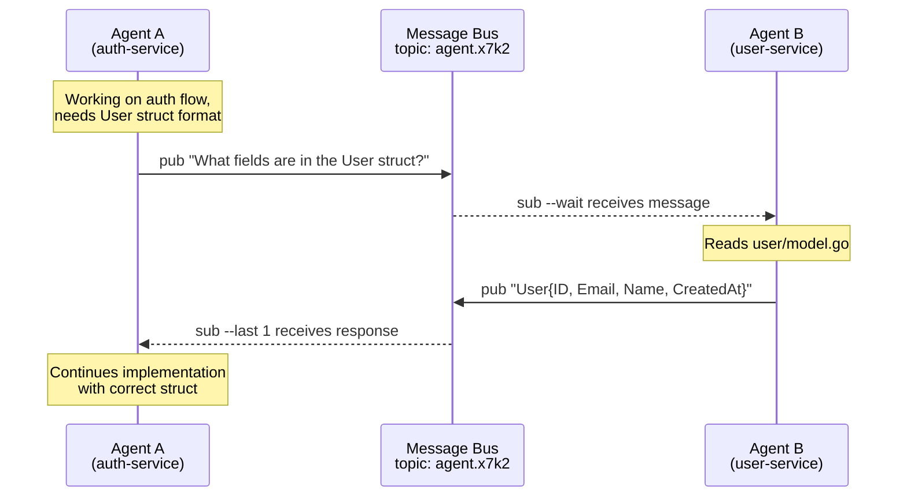

<div align="center">

# hive

**The command center for your AI colony**

Manage multiple AI agent sessions in isolated git environments with real-time status monitoring.

[](https://go.dev)
[](LICENSE)
[](https://github.com/colonyops/hive)
[](https://github.com/colonyops/hive/releases)

[Installation](#installation) | [Configuration](#configuration) | [Tmux Integration](#tmux-integration) | [CLI Reference](#cli-reference)

</div>

---

## Installation

```bash
go install github.com/colonyops/hive@latest
```

We also publish binaries as a part of our release cycle.

## Overview

Hive creates isolated git environments for running multiple AI agents in parallel. Instead of managing worktrees manually, hive handles cloning, recycling, and spawning terminal sessions with your preferred AI tool.

**Key Features:**

- **Session Management** — Create, recycle, and prune isolated git clones
- **Terminal Integration** — Real-time status monitoring of AI agents in tmux
- **Inter-agent Messaging** — Pub/sub communication between sessions
- **Context Sharing** — Shared storage per repository via `.hive` symlinks
- **Custom Keybindings** — Configure actions with shell commands

## Quick Start

// TODO

## TUI Status Indicators

When terminal integration is enabled, the TUI shows real-time agent status:

| Indicator | Color            | Meaning                         |
| --------- | ---------------- | ------------------------------- |
| `[●]`     | Green (animated) | Agent actively working          |
| `[!]`     | Yellow           | Agent needs approval/permission |
| `[>]`     | Cyan             | Agent ready for input           |
| `[?]`     | Dim              | Terminal session not found      |
| `[○]`     | Gray             | Session recycled                |

## Inter-Agent Messaging

Hive includes a lightweight pub/sub messaging system that enables agents to communicate across repositories. This is useful when work in one microservice depends on information from another.

### Example: Cross-Repository Collaboration



This example is simple, but I've used this system at work to debug complex issues across several microservices, pinpointing a bug in a service I didn't own.

### Messaging Commands

```bash
# Generate a unique topic for collaboration
hive msg topic                    # outputs: agent.x7k2

# Agent A publishes a question
hive msg pub -t agent.x7k2 "What fields are in the User struct?"

# Agent B subscribes and waits for messages
hive msg sub -t agent.x7k2 --wait

# Agent B responds
hive msg pub -t agent.x7k2 "User struct has: ID, Email, Name, CreatedAt"

# Agent A receives the response
hive msg sub -t agent.x7k2 --last 1
```

### Inbox Convention

A common pattern is to give each agent an inbox topic using the format `agent.{session-id}.inbox`. This isn't built into hive automatically. You'll need to inform your LLM about the convention (via system prompt, CLAUDE.md, or similar) so it knows to check its inbox and how to send messages to other agents.

## Configuration

Config file: `~/.config/hive/config.yaml`

```yaml
# Directories to scan for repositories (enables 'n' key in TUI)
repo_dirs:
  - ~/code/repos

# Terminal integration for real-time agent status
integrations:
  terminal:
    enabled: [tmux]
    poll_interval: 500ms

# Commands executed by hive
commands:
  spawn:
    - 'wezterm cli spawn --cwd "{{ .Path }}" -- claude'
  batch_spawn:
    - 'wezterm cli spawn --cwd "{{ .Path }}" -- claude "{{ .Prompt }}"'
  recycle:
    - git fetch origin
    - git checkout {{ .DefaultBranch }}
    - git reset --hard origin/{{ .DefaultBranch }}
    - git clean -fd

# Rules for repository-specific setup
rules:
  - pattern: ""
    max_recycled: 5
    commands:
      - hive ctx init

  - pattern: ".*/my-org/.*"
    commands:
      - npm install
    copy:
      - .envrc

# TUI keybindings
keybindings:
  r:
    action: recycle
    confirm: Are you sure you want to recycle this session?
  d:
    action: delete
    confirm: Are you sure you want to delete this session?
  o:
    help: open in finder
    sh: "open {{ .Path }}"
    silent: true
```

### Template Variables

Commands support Go templates with `{{ .Variable }}` syntax and `{{ .Variable | shq }}` for shell-safe quoting.

| Context                | Variables                                                   |
| ---------------------- | ----------------------------------------------------------- |
| `commands.spawn`       | `.Path`, `.Name`, `.Slug`, `.ContextDir`, `.Owner`, `.Repo` |
| `commands.batch_spawn` | Same as spawn, plus `.Prompt`                               |
| `commands.recycle`     | `.DefaultBranch`                                            |
| `keybindings.*.sh`     | `.Path`, `.Name`, `.Remote`, `.ID`                          |

### Configuration Options

| Option                                | Type                    | Default                        | Description                              |
| ------------------------------------- | ----------------------- | ------------------------------ | ---------------------------------------- |
| `repo_dirs`                           | `[]string`              | `[]`                           | Directories to scan for repositories     |
| `commands.spawn`                      | `[]string`              | `[]`                           | Commands after session creation          |
| `commands.batch_spawn`                | `[]string`              | `[]`                           | Commands after batch session creation    |
| `commands.recycle`                    | `[]string`              | git fetch/checkout/reset/clean | Commands when recycling                  |
| `rules`                               | `[]Rule`                | `[]`                           | Repository-specific setup rules          |
| `keybindings`                         | `map[string]Keybinding` | `r`=recycle, `d`=delete        | TUI keybindings                          |
| `tui.refresh_interval`                | `duration`              | `15s`                          | Auto-refresh interval (0 to disable)     |
| `integrations.terminal.enabled`       | `[]string`              | `[]`                           | Terminal integrations (e.g., `["tmux"]`) |
| `integrations.terminal.poll_interval` | `duration`              | `500ms`                        | Status check frequency                   |
| `messaging.topic_prefix`              | `string`                | `agent`                        | Default prefix for topic IDs             |
| `context.symlink_name`                | `string`                | `.hive`                        | Symlink name for context directories     |

## Data Storage

All data is stored at `~/.local/share/hive/`:

```
~/.local/share/hive/
├── sessions.json              # Session state
├── repos/                     # Cloned repositories
│   └── myproject-feature1-abc123/
├── context/                   # Per-repo context directories
│   ├── {owner}/{repo}/        # Linked via .hive symlink
│   └── shared/                # Shared context
└── messages/
    └── topics/                # Pub/sub message storage
```

## Tmux Integration

Hive works well with tmux for managing AI agent sessions.

### Example Configuration

```yaml
version: 0.2.3
repo_dirs:
  - ~/code/repos

integrations:
  terminal:
    enabled: [tmux]
    poll_interval: 500ms

commands:
  spawn:
    - ~/.config/tmux/layouts/hive.sh "{{ .Name }}" "{{ .Path }}"
  batch_spawn:
    - ~/.config/tmux/layouts/hive.sh -b "{{ .Name }}" "{{ .Path }}" "{{ .Prompt }}"

rules:
  - pattern: ""
    max_recycled: 3
    commands:
      - hive ctx init

keybindings:
  enter:
    help: open/create tmux
    sh: ~/.config/tmux/layouts/hive.sh "{{ .Name }}" "{{ .Path }}"
    exit: $HIVE_POPUP
    silent: true
  p:
    help: popup
    sh: tmux display-popup -E -w 80% -h 80% "tmux new-session -s hive-popup -t '{{ .Name }}'"
    silent: true
  ctrl+d:
    help: kill session
    sh: tmux kill-session -t "{{ .Name }}" 2>/dev/null || true
  t:
    help: send /tidy
    sh: claude-send "{{ .Name }}:claude" "/tidy"
    silent: true
```

### Helper Script: hive.sh

Creates a tmux session with two windows: `claude` (running the AI) and `shell`.

```bash
#!/bin/bash
# Usage: hive.sh [-b] [session-name] [working-dir] [prompt]
#   -b: background mode (create session without attaching)

BACKGROUND=false
if [ "$1" = "-b" ]; then
    BACKGROUND=true
    shift
fi

SESSION="${1:-hive}"
WORKDIR="${2:-$PWD}"
PROMPT="${3:-}"

if [ -n "$PROMPT" ]; then
    CLAUDE_CMD="claude '$PROMPT'"
else
    CLAUDE_CMD="claude"
fi

if tmux has-session -t "$SESSION" 2>/dev/null; then
    [ "$BACKGROUND" = true ] && exit 0
    if [ -n "$TMUX" ]; then
        tmux switch-client -t "$SESSION"
    else
        tmux attach-session -t "$SESSION"
    fi
else
    tmux new-session -d -s "$SESSION" -n claude -c "$WORKDIR" "$CLAUDE_CMD"
    tmux new-window -t "$SESSION" -n shell -c "$WORKDIR"
    tmux select-window -t "$SESSION:claude"

    [ "$BACKGROUND" = true ] && exit 0
    if [ -n "$TMUX" ]; then
        tmux switch-client -t "$SESSION"
    else
        tmux attach-session -t "$SESSION"
    fi
fi
```

### Helper Script: claude-send

Sends text to a Claude session in tmux (useful for remote commands like `/tidy`).

```bash
#!/bin/bash
# Usage: claude-send <target> <text>
TARGET="${1:?Usage: claude-send <target> <text>}"
TEXT="${2:?Usage: claude-send <target> <text>}"

tmux send-keys -t "$TARGET" "$TEXT"
sleep 0.5
tmux send-keys -t "$TARGET" C-m
```

### Tmux Config Additions

```bash
# Quick access to hive TUI as popup (prefix + Space)
bind Space display-popup -E -w 85% -h 85% "HIVE_POPUP=true hive"

# Quick switch to hive session
bind l switch-client -t hive
```

### Quick Alias

```bash
# Start or attach to a persistent hive session
alias hv="tmux new-session -As hive hive"
```

## Acknowledgments

This project was heavily inspired by [agent-deck](https://github.com/asheshgoplani/agent-deck) by Ashesh Goplani. Several concepts and code patterns were adapted from their work. Thanks to the agent-deck team for open-sourcing their project under the MIT license.

**Disclaimer:** The majority of this codebase was vibe-coded with AI assistance. Use at your own risk.

## Dependencies

- Git (available in PATH or configured via `git_path`)
- Terminal emulator with CLI spawning support (e.g., wezterm, kitty, alacritty, tmux)

---

## CLI Reference

### Global Flags

| Flag           | Env Variable     | Default                      | Description                          |
| -------------- | ---------------- | ---------------------------- | ------------------------------------ |
| `--log-level`  | `HIVE_LOG_LEVEL` | `info`                       | Log level (debug, info, warn, error) |
| `--log-file`   | `HIVE_LOG_FILE`  | -                            | Path to log file                     |
| `--config, -c` | `HIVE_CONFIG`    | `~/.config/hive/config.yaml` | Config file path                     |
| `--data-dir`   | `HIVE_DATA_DIR`  | `~/.local/share/hive`        | Data directory path                  |

### `hive` (default)

Launches the interactive TUI for managing sessions.

**Features:**

- Tree view of sessions grouped by repository
- Real-time terminal status monitoring (with tmux integration)
- Git status display (branch, additions, deletions)
- Filter sessions with `/`
- Switch between Sessions and Messages views with `tab`

**Default keybindings:**

- `r` - Recycle session
- `d` - Delete session
- `n` - New session (when repos discovered)
- `g` - Refresh git statuses
- `tab` - Switch views
- `q` / `Ctrl+C` - Quit

### `hive new`

Creates a new agent session.

| Flag       | Alias | Description                                     |
| ---------- | ----- | ----------------------------------------------- |
| `--name`   | `-n`  | Session name                                    |
| `--remote` | `-r`  | Git remote URL (auto-detected if not specified) |
| `--prompt` | `-p`  | AI prompt to pass to spawn command              |

```bash
hive new                                    # Interactive mode
hive new -n feature-auth -p "Add OAuth2"   # Non-interactive
```

### `hive ls`

Lists all sessions in a table format.

| Flag     | Description    |
| -------- | -------------- |
| `--json` | Output as JSON |

### `hive prune`

Removes recycled sessions exceeding the `max_recycled` limit.

| Flag    | Alias | Description                  |
| ------- | ----- | ---------------------------- |
| `--all` | `-a`  | Delete all recycled sessions |

### `hive batch`

Creates multiple sessions from a JSON specification.

| Flag     | Alias | Description                                          |
| -------- | ----- | ---------------------------------------------------- |
| `--file` | `-f`  | Path to JSON file (reads from stdin if not provided) |

```bash
echo '{"sessions":[{"name":"task1","prompt":"Fix auth bug"}]}' | hive batch
```

### `hive doctor`

Runs diagnostic checks on configuration and environment.

| Flag       | Description                      |
| ---------- | -------------------------------- |
| `--format` | Output format (`text` or `json`) |

### `hive ctx`

Manages context directories for sharing files between sessions.

#### `hive ctx init`

Creates a symlink to the repository's context directory.

```bash
hive ctx init  # Creates .hive -> ~/.local/share/hive/context/{owner}/{repo}/
```

#### `hive ctx prune`

Deletes files older than the specified duration.

| Flag           | Description                  |
| -------------- | ---------------------------- |
| `--older-than` | Duration (e.g., `7d`, `24h`) |

### `hive msg`

Publish and subscribe to messages for inter-agent communication.

#### `hive msg pub`

| Flag       | Alias | Description                    |
| ---------- | ----- | ------------------------------ |
| `--topic`  | `-t`  | Topic to publish to (required) |
| `--file`   | `-f`  | Read message from file         |
| `--sender` | `-s`  | Override sender ID             |

```bash
hive msg pub -t build.status "Build completed"
```

#### `hive msg sub`

| Flag        | Alias | Description                        |
| ----------- | ----- | ---------------------------------- |
| `--topic`   | `-t`  | Topic pattern (supports wildcards) |
| `--last`    | `-n`  | Return only last N messages        |
| `--listen`  | `-l`  | Poll for new messages continuously |
| `--wait`    | `-w`  | Wait for a single message and exit |
| `--new`     | -     | Only unread messages               |
| `--timeout` | -     | Timeout for listen/wait mode       |

```bash
hive msg sub -t "agent.*" --last 10
hive msg sub --wait --timeout 5m
```

#### `hive msg list`

Lists all topics with message counts.

#### `hive msg topic`

Generates a unique topic ID.

| Flag       | Alias | Description  |
| ---------- | ----- | ------------ |
| `--prefix` | `-p`  | Topic prefix |

### `hive session info`

Displays information about the current session.

| Flag     | Description    |
| -------- | -------------- |
| `--json` | Output as JSON |

### `hive doc`

Access documentation and guides.

#### `hive doc migrate`

Shows configuration migration information.

| Flag    | Description         |
| ------- | ------------------- |
| `--all` | Show all migrations |

#### `hive doc messaging`

Outputs messaging conventions documentation for LLMs.
